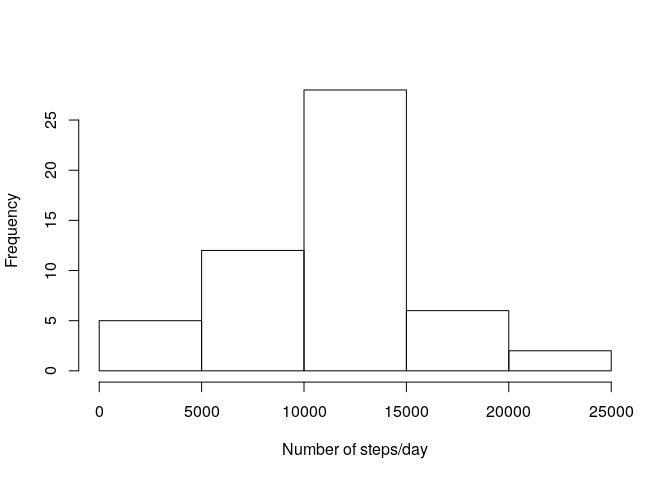
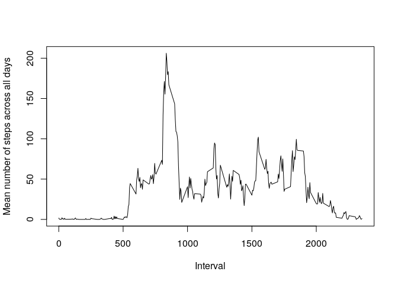
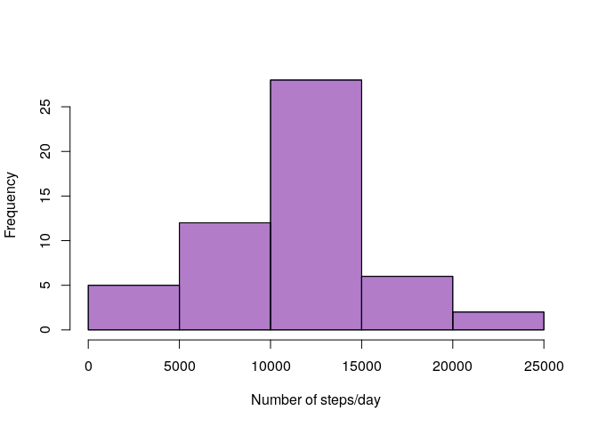
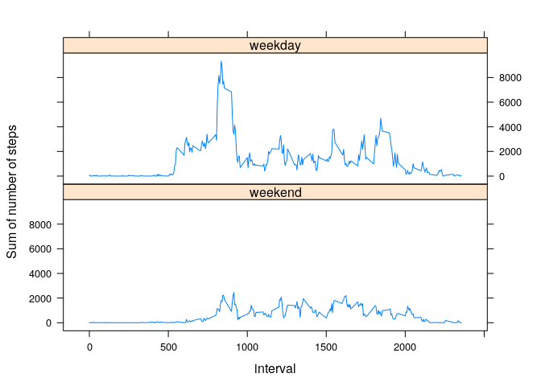

## Loading and preprocessing the data

We don't need to download the data, since it is already included in the forked
repository.

After we unzipped and read in the csv-file, we need to convert the date column
into date objects.


```r
unzip("activity.zip")
data <- read.csv("activity.csv")
data$date <- as.Date(data$date)
```

## Histogram of the total number of steps taken each day


```r
cumpday <- aggregate(data$steps, list(data$date), sum)
hist(cumpday$x, main="", xlab="Number of steps/day")
```

<!-- -->

## Mean and median number of steps per day


```r
mean(cumpday$x, na.rm=T)
```

```
## [1] 10766.19
```

```r
median(cumpday$x, na.rm=T)
```

```
## [1] 10765
```

## What is the average daily activity pattern?

```r
meanpint <- aggregate(data$steps, list(data$interval), mean, na.rm = T)
plot(meanpint,
     type="l",
     xlab="Interval",
     ylab="Mean number of steps across all days")
```

<!-- -->

## Which interval on average contains the maximum number of steps?


```r
maxint <- meanpint[meanpint$x == max(meanpint$x),]
names(maxint) <- c("Interval", "x")
maxint
```

```
##     Interval        x
## 104      835 206.1698
```

## Imputing missing values

There are different strategies for imputing missing values in the data set like
filling them with the mean or average of the intervals on that given day, the
interval across all days or the mean or average of that given day across all
intervals. Another possibility is to use the average or the mean of the
neighbouring intervals.

The latter fails if the neighbouring intervals are missing, too. We'd have to
look for the next available value in the set.

Using the mean or the median might introduce non-integer values. A number of
steps can only be a natural number. Rounding the value seems a little bit
arbitrary.

Because we already have calculated the mean steps per interval across all days
and for our analysis it's not important to have integer steps, we'll use this
strategy.


```r
newdata <- data
for (x in which(is.na(data$steps))) newdata[x, "steps"] = meanpint[x, "x"]
```

### Impact on the integrity of the data

Let's plot an histogram of the old data over one of the new data. As we can see,
there isn't that much of a difference.


```r
newcumpday <- aggregate(data$steps, list(data$date), sum)
hist(newcumpday$x, xlab="", main="", col=rgb(1,0,0,.3))
hist(cumpday$x, xlab="", main="", col=rgb(0,0,1,.3), add=T)
title(xlab="Number of steps/day", main="")
```

<!-- -->

Let's also look at the mean and median steps per day. The imputing seems to be
no problem.

* Old

```r
mean(cumpday$x, na.rm=T)
```

```
## [1] 10766.19
```

```r
median(cumpday$x, na.rm=T)
```

```
## [1] 10765
```

* New

```r
mean(newcumpday$x, na.rm=T)
```

```
## [1] 10766.19
```

```r
median(newcumpday$x, na.rm=T)
```

```
## [1] 10765
```

## Are there differences in activity patterns between weekdays and weekends?

The activity patterns on the weekends show fewer spikes and are overall
smoother.


```r
library(lattice)

# Discriminate data between weekdays and weekends
newdata$wd <- factor(weekdays(newdata$date) %in% c("Saturday","Sunday"),
                     levels=c(T, F),
                     labels = c("weekend", "weekday"))

# Aggregate steps sum by weekday and interval
meanpintpwd <- aggregate(steps ~ wd + interval, newdata, sum)

xyplot(steps ~ interval | wd, meanpintpwd, type="l", layout=c(1,2), ylab="Sum of number of steps")
```

<!-- -->
